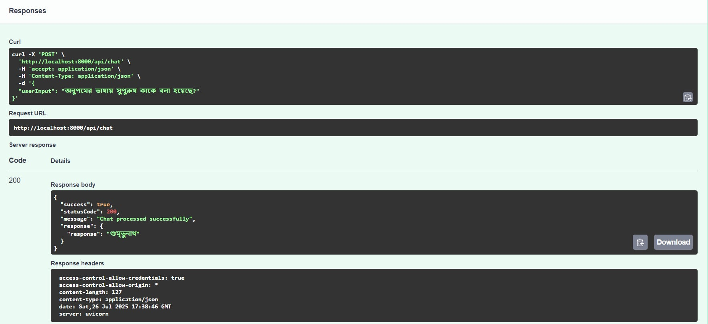
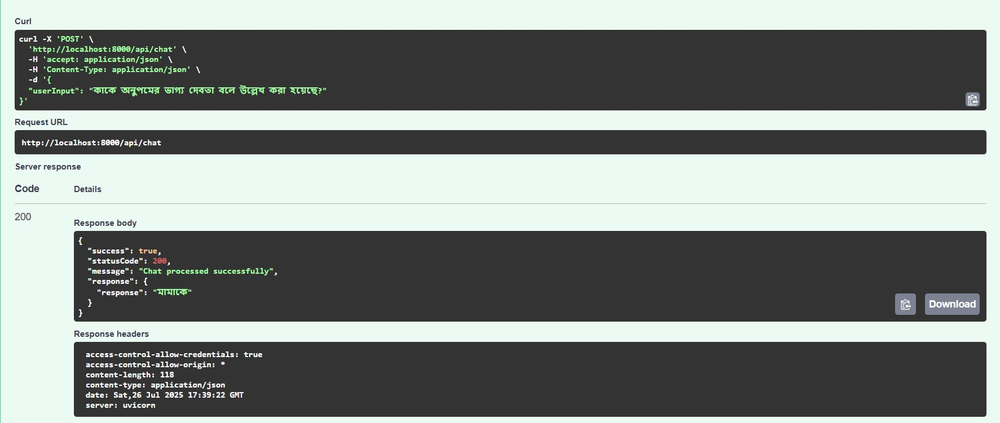
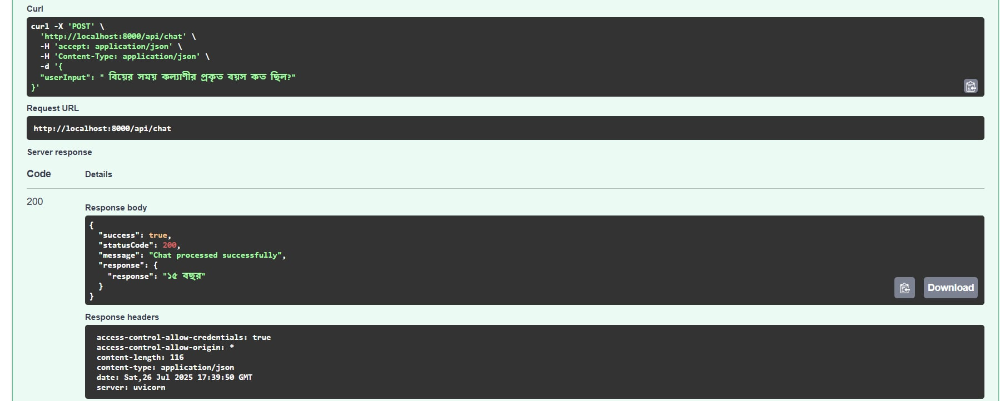

# Assignment Submission: Simple Multilingual RAG System

This repository contains the source code for a Retrieval-Augmented Generation (RAG) system designed to meet the requirements of the assignment. The system processes queries in both English and Bengali, retrieves relevant information from a provided PDF document, and generates answers grounded in that context.

## 1. Objective

The primary objective was to design and implement a basic RAG pipeline capable of understanding and responding to both English and Bengali queries. The system fetches relevant information from a PDF document corpus (`HSC26 Bangla 1st paper`) and generates a meaningful answer grounded in the retrieved content.

## 2. Used Tools, Libraries & Packages

The project leverages a modern, production-ready stack to ensure robustness and maintainability.

| Category              | Tool / Library                     | Justification                                                                                              |
| --------------------- | ---------------------------------- | ---------------------------------------------------------------------------------------------------------- |
| **Web Framework**     | `FastAPI`                          | High-performance, asynchronous Python framework for building the REST API with automatic docs.             |
| **LLM Orchestration** | `LangChain`, `LangGraph`           | To structure the RAG flow as a state machine, managing retrieval, generation, and memory.                  |
| **LLM & Embeddings**  | `Google Gemini 2.5/gemini-embedding-001`            | State-of-the-art model used for both intelligent text extraction and final answer generation.              |
| **Vector Database**   | `ChromaDB`                         | Lightweight, developer-friendly vector store for persisting and querying document embeddings.              |
| **Dependencies**      | `Poetry`                           | For robust dependency management and reproducible builds.                                                  |
| **Containerization**  | `Docker`, `Docker Compose`         | To ensure a consistent and isolated development/runtime environment.                                       |
| **Code Quality**      | `isort`, `black`, `flake8`, `mypy` | A suite of tools to enforce consistent formatting, style, and static type checking for production quality. |

## 3. Setup & Installation Guide

The project is fully containerized, making setup straightforward.

### Prerequisites

-   Docker
-   Docker Compose

### Running the Application

1.  **Clone the repository:**

    ```bash
    git clone https://github.com/hm-badhon/assignment-hm-mehedi-hasan
    ```

2.  **Set Up Environment:**
    Create a `.env` file in the project root and add your Gemini API key:

    ```
    GEMINI_API_KEY="your_gemini_api_key"
    ```

3.  **Run the application using the helper script:**
    ```bash
    python run.py
    ```
    This script handles stopping old containers, rebuilding the Docker images, and starting the API service. The API will be available at `http://localhost:8080`.

## 4. API Documentation

A simple REST API is provided for interacting with the RAG system.

-   **Endpoint**: `POST /api/chat`
-   **Description**: Accepts a user query and returns a model-generated response.

### Request Body

```json
{
	"userInput": "আপনার প্রশ্ন এখানে"
}
```

### Success Response (200 OK)

```json
{
	"success": true,
	"statusCode": 200,
	"message": "Chat processed successfully",
	"response": {
		"response": "এখানে মডেল-জেনারেটেড উত্তর থাকবে।"
	}
}
```

The full interactive OpenAPI documentation is available at `http://localhost:8080/docs` after starting the application.

## 5. Sample Queries & Outputs

The following are test cases demonstrating the system's ability to answer questions based on the corpus.







## 6. Core Implementation Questions

### Q1: What method or library did you use to extract the text, and why? Did you face any formatting challenges with the PDF content?

-   **Method:** We used the **Gemini 2.5 Pro Large Language Model** to perform text extraction, not a traditional library like PyMuPDF or an OCR engine like Tesseract. The implementation can be found in `src/services/rag/preprocessing/preprocess.py`.

-   **Why:** The source PDF (`HSC26 Bangla 1st paper`) has a complex, multi-column layout containing narrative text, poetry, tables, vocabulary lists, and structured Q&As (including multiple-choice questions).

    -   **Limitation of OCR:** A generic OCR/text-extraction tool would flatten this structure into a single stream of text, losing the critical relationships between, for example, a question and its answer, or a term and its definition. This makes meaningful chunking nearly impossible.
    -   **Advantage of LLM-based Extraction:** By using an LLM, we can provide a detailed prompt (`src/services/rag/prompts/v250718/extract_prompt.txt`) that instructs the model to act as an intelligent parser. We specifically command it to:
        1.  Re-structure all questions into a direct Q&A format.
        2.  Discard incorrect options from multiple-choice questions, reducing noise.
        3.  Group related items (like an entire list of learning outcomes) into a single block.
        4.  Use double newlines (`\n\n`) as a deliberate separator between these logically distinct chunks of information.

-   **Formatting Challenges:** This LLM-based approach directly mitigates the formatting challenges. Instead of cleaning up messy output from a generic library, we guide the extraction process itself to produce clean, well-structured, and analysis-ready text from the outset. The output is saved to `data/processed.txt`.

### Q2: What chunking strategy did you choose? Why do you think it works well for semantic retrieval?

-   **Strategy:** We used a combination of two strategies:

    1.  **Upstream LLM-based Pre-chunking:** As described above, the text extraction prompt instructs the LLM to format the output so that semantically related content blocks (a full Q&A, a vocabulary term and its definition, etc.) are separated by double newlines.
    2.  **Downstream Character-based Splitting:** We then use LangChain's `RecursiveCharacterTextSplitter`, configured to split the text primarily by the `\n\n` separator, with a target chunk size of 1000 characters and an overlap of 100.

-   **Why It Works:** This hybrid approach is highly effective. The initial LLM-based formatting ensures our splits respect the logical and semantic boundaries of the original document. The subsequent character splitting simply acts as a fallback to divide any exceptionally long blocks, ensuring no single chunk exceeds the context window of the embedding model. This preserves the semantic integrity of the data, which is crucial for high-quality retrieval.

### Q3: What embedding model did you use? Why did you choose it?

-   **Model:** We used Google's `gemini-embedding-001` model, accessed via the `GeminiEmbeddingFunction` defined in `src/database/chroma_db.py`.

-   **Why:**
    1.  **High Performance:** It is a state-of-the-art model known for strong performance on multilingual benchmarks, which is essential for a system that must handle both Bengali and English.
    2.  **Ecosystem Consistency:** Since we use a Gemini model for text extraction and generation, using the corresponding Gemini embedding model ensures consistency and compatibility within the same API and billing framework.
    3.  **Semantic Capture:** It creates dense vector representations (embeddings) where the position of the vector in high-dimensional space captures the semantic meaning of the text, not just its keywords. This allows for finding relevant chunks based on conceptual similarity, not just word overlap.

### Q4: How are you comparing the query with your stored chunks? Why did you choose this similarity method and storage setup?

-   **Comparison Method:** We use **Cosine Similarity** to compare the vector of the user's query against the vectors of all stored document chunks. The chunks with the highest similarity scores (i.e., the smallest angle between their vectors and the query vector) are retrieved.

-   **Storage Setup:** We use **ChromaDB**, a dedicated open-source vector database.
    -   It is lightweight, easy to set up via Docker, and ideal for projects of this scale.
    -   It natively handles the storage of embeddings and the execution of the nearest-neighbor (similarity) search required for retrieval.
    -   The entire database is persisted to the `./chroma_data` volume, ensuring the knowledge base survives application restarts.

### Q5: How do you ensure meaningful comparison? What would happen if the query is vague?

-   **Meaningful Comparison:** The key is using the **exact same embedding model** to convert both the document chunks (at storage time) and the user's query (at query time) into vectors. Because they are mapped into the same vector space, a direct comparison is mathematically and semantically meaningful.

-   **Vague Queries:** If a query is vague, the system's performance may degrade, but it is designed to be resilient.
    -   **Current Behavior:** The vector search will still retrieve the chunks that are _most similar_ to the vague query, even if the similarity score is low. The final LLM then generates an answer based on this potentially suboptimal context. The answer might be generic or state that it cannot find specific information.
    -   **Potential Improvement:** A key improvement would be **Query Expansion**. Before searching, we could use an LLM to rephrase the user's vague query into several more specific, potential questions. We would then run a search for all variants and merge the results, increasing the chance of retrieving relevant context.

### Q6: Do the results seem relevant? If not, what might improve them?

-   **Relevance:** For the provided test cases and many similar factual queries, the results are highly relevant. This is a direct result of the high-fidelity, LLM-driven text extraction and chunking strategy.

-   **Potential Improvements:**
    1.  **Query Expansion:** As mentioned above, this would significantly improve robustness against ambiguous queries.
    2.  **Advanced Retrieval Strategies:** Implement a hybrid search that considers not only vector similarity but also keyword matching (e.g., using BM25) to better handle queries with specific, rare terms.
    3.  **Switch to a Production-Grade Vector DB:** Migrating from ChromaDB to a more robust database like **Qdrant** or **PostgreSQL with pgvector** would offer more advanced filtering, scalability, and fine-grained control over the indexing process.


Thank you.
